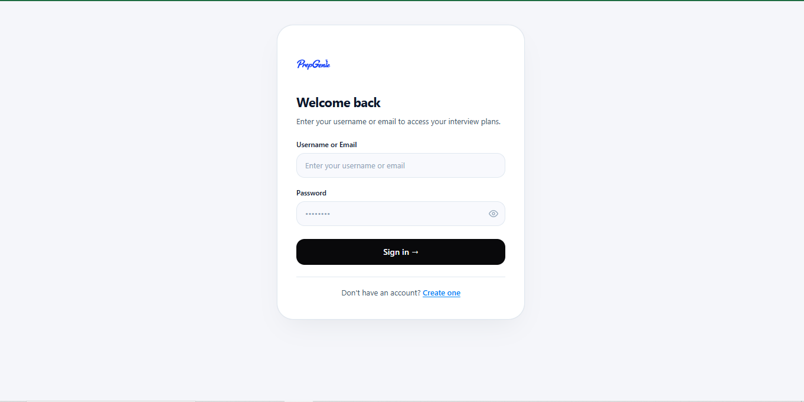
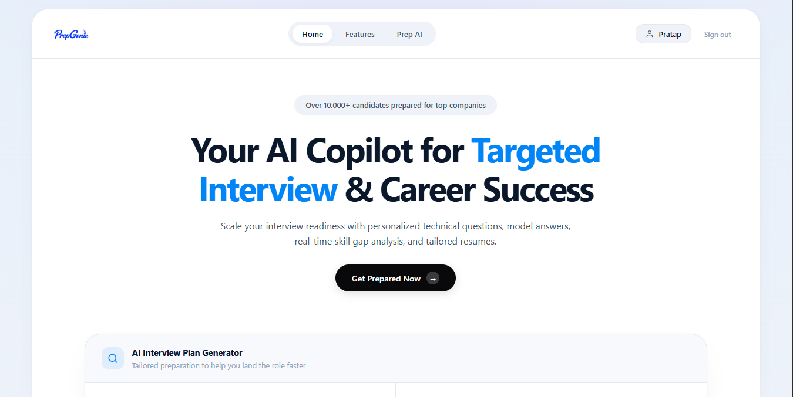
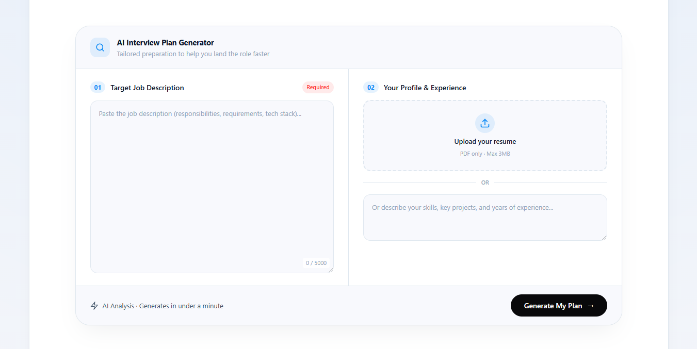
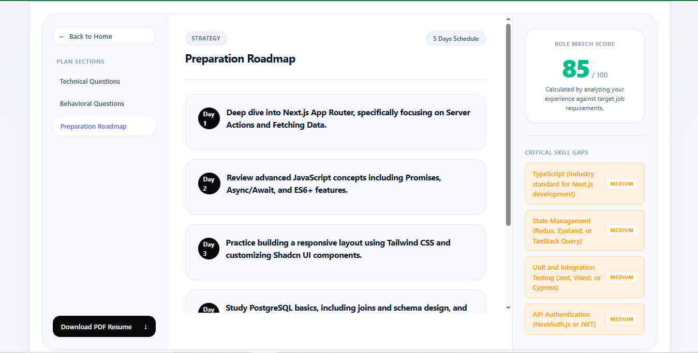
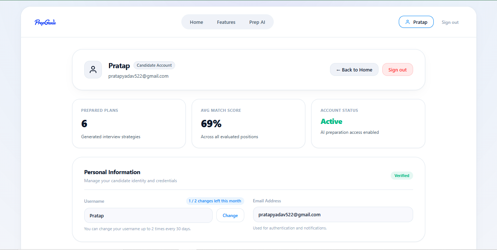

# PrepGenie

PrepGenie is an AI-powered interview preparation platform that helps
candidates prepare for job interviews using their resume,
self-description, and target job description.

It analyzes the candidate's profile against a job description and
generates a personalized preparation report with a match score,
technical questions, behavioral questions, model answers, skill gaps,
and a preparation plan.

Features

User registration and login

JWT-based authentication with cookies

Resume PDF upload

Job description analysis

AI-powered candidate-to-job matching

Interview match score

Technical interview questions

Technical model answers

Behavioral interview questions

Behavioral model answers

Interviewer intention for each question

Personalized skill-gap analysis

Day-by-day preparation plan

Saved interview reports

Previous report history

AI-generated resume functionality

Protected routes

MongoDB data storage

Tech Stack

Frontend

React

Vite

React Router

Axios

SCSS

Backend

Node.js

Express.js

MongoDB

Mongoose

JWT

bcrypt

Multer

PDF parsing

Google Gemini API

Deployment

Vercel --- Frontend

Render --- Backend

MongoDB Atlas --- Database

How It Works

User
  |
  v
React Frontend
  |
  | Job Description
  | Resume PDF
  | Self Description
  v
Express Backend
  |
  v
Gemini AI
  |
  v
Interview Analysis
  |
  +-- Match Score
  +-- Technical Questions
  +-- Model Answers
  +-- Behavioral Questions
  +-- Skill Gaps
  +-- Preparation Plan
  |
  v
MongoDB
  |
  v
Saved Interview Report

# Project Structure

text
PrepGenie/
├── Backend/
│   ├── src/
│   │   ├── config/             # Database connection setup
│   │   ├── controllers/        # Auth & Interview business logic
│   │   ├── middlewares/        # JWT auth verification middleware
│   │   ├── models/             # Mongoose schemas (User, InterviewReport, Blacklist)
│   │   ├── routes/             # Express API routes
│   │   ├── services/           # Gemini AI & PDF generation services
│   │   └── server.js           # Server entry point
│   ├── package.json
│   └── .env.example
│
└── Frontend/
    ├── public/                 # Static assets & PrepGenie logo
    ├── src/
    │   ├── components/         # Shared UI components (Navbar, Layout, Protected)
    │   ├── features/
    │   │   ├── auth/           # Auth pages (Login, Register, Profile), context, hooks, API
    │   │   └── interview/      # Interview generator, dashboard, context, hooks, API
    │   ├── styles/             # CSS design tokens, layout & global stylesheets
    │   ├── App.jsx             # Main application wrapper
    │   ├── app.routes.jsx      # Route definitions
    │   └── main.jsx            # React root mount
    ├── package.json
    └── vite.config.js

---

# Getting Started & Local Setup

Prerequisites

Install:

Node.js

npm

Git

MongoDB Atlas account

Google Gemini API key

Clone the repository

git clone YOUR_GITHUB_REPOSITORY_URL
cd PrepGenie

Backend Setup

cd Backend
npm install

Create Backend/.env:

PORT=3000
MONGO_URI=your_mongodb_connection_string
JWT_SECRET=your_jwt_secret
GEMINI_API_KEY=your_gemini_api_key

Start the backend:

npm run dev

For production:

npm start

Backend:

http://localhost:3000

Frontend Setup

Open another terminal:

cd Frontend
npm install

Create Frontend/.env:

VITE_API_URL=http://localhost:3000

Start the frontend:

npm run dev

Frontend:

http://localhost:5173

Environment Variables

Backend

Variable           Purpose
Make sure you have the following installed:
- [Node.js](https://nodejs.org/) (v18 or higher)
- [MongoDB](https://www.mongodb.com/) (Local instance or MongoDB Atlas URI)
- [Google Gemini API Key](https://aistudio.google.com/app/apikey)

---

### 1. Backend Setup

1. Open your terminal and navigate to the backend folder:
   cd Backend
   

2. Install dependencies:
   npm install

3. Create a `.env` file in the `Backend/` directory:
   
   PORT=3000
   MONGO_URI=mongodb://localhost:27017/prepgenie
   JWT_SECRET=your_super_secret_jwt_key_here
   GEMINI_API_KEY=your_google_gemini_api_key_here

4. Start the backend server:
   npm run dev
   The server will run on http://localhost:3000

### 2. Frontend Setup

1. Open a new terminal tab and navigate to the frontend folder:
   cd Frontend
   

2. Install dependencies:
   npm install
   

3. Start the Vite development server:
   npm run dev
   The frontend application will open on http://localhost:5173

#API Endpoints Overview

### Authentication (`/api/auth`)
| Method | Endpoint | Description | Auth Required |
| :--- | :--- | :--- | :--- |
| `POST` | `/api/auth/register` | Register a new user account | No |
| `POST` | `/api/auth/login` | Login with username or email | No |
| `GET` | `/api/auth/logout` | Clear cookie and invalidate session | Yes |
| `GET` | `/api/auth/get-me` | Fetch logged-in user profile & update quota | Yes |
| `PATCH` | `/api/auth/update-username` | Update username (limit 2 times/30 days) | Yes |

# Interview Plans (`/api/interview`)
| Method | Endpoint | Description | Auth Required |
| :--- | :--- | :--- | :--- |
| `POST` | `/api/interview/generate` | Generate AI interview plan from job desc & resume | Yes |
| `GET` | `/api/interview/reports` | Get all interview plans for the logged-in candidate | Yes |
| `GET` | `/api/interview/report/:id` | Get details for a specific interview plan | Yes |
| `GET` | `/api/interview/resume-pdf/:id` | Download tailored ATS resume PDF | Yes |

---

# Verification & Building

To test and build the frontend application for production:

# Check code quality and formatting
npm run lint

# Build production bundle
npm run build

# Preview production build locally
npm run preview

# Resume Processing

Users can provide their profile by:

Uploading a PDF resume/Entering a self-description

The backend extracts the resume text and combines it with the candidate
information and target job description before sending it to the AI
service.

The generated report is stored in MongoDB.

# AI Report

Each report can contain:

Match score

Job title

Technical interview questions

Technical model answers

Behavioral interview questions

Behavioral model answers

Interviewer intentions

Skill gaps

Personalized preparation plan

# Deployment

Recommended deployment setup:

Frontend  → Vercel
Backend   → Render
Database  → MongoDB Atlas

# Frontend

Build:

npm run build

Deploy the Frontend directory to Vercel.

Set:

VITE_API_URL=https://YOUR-BACKEND-URL

# Backend

Deploy the Backend directory as a Node.js web service on Render.

Use:

Build Command:
npm install

Start Command:
npm start

Configure the production environment variables on Render:

MONGO_URI=your_mongodb_connection_string
JWT_SECRET=your_jwt_secret
GEMINI_API_KEY=your_gemini_api_key

# Screenshots

# Future Improvements

Resume management

Interview progress tracking

Mock interview mode

AI-powered answer evaluation

Voice-based mock interviews

Interview performance analytics

Career recommendations

Improved mobile experience

Additional interview preparation modes

# A Note From Author

PrepGenie is a portfolio project built to explore AI-powered interview
preparation, full-stack web development, authentication, file
processing, and API integration. 
 
 -Pratap Yadav

# License

This project is open source and creae for portfolio purpose.
